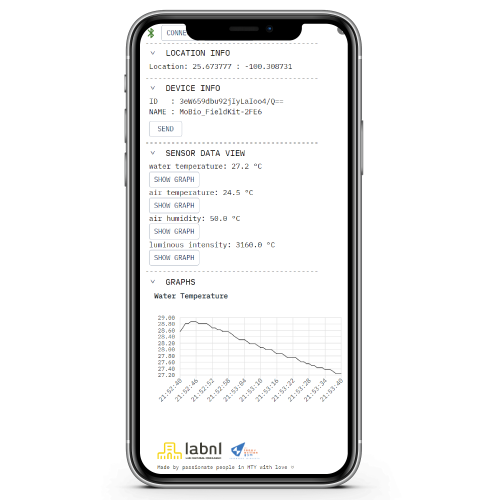

# FiledKit SensorBox UI
- WIP!
- See current version online: https://fieldkit-ui.ok-y.xyz/
- This project was created as a part of the team effort of the **Modular Environmental MicroMuseum (Mobio)** group from the LABNL Lab and the InnovactionGYM in Monterrey, Mexico for the Fab Mexico Challenge 2024
- This is the UI for the SensorBox project you can find here: https://github.com/kyjanond/labnl-fieldkit
- It was created fast, dirty and it probably contains lots of bugs. No guarantees.

### install and run locally
```
npm install
vite
```